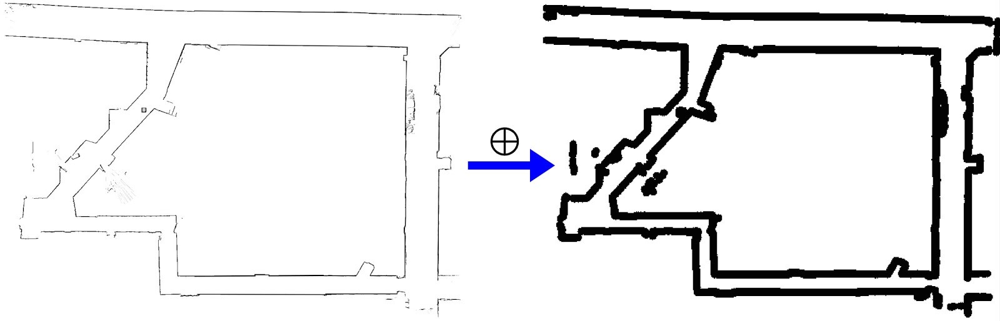

| Deliverable                                                            | Due Date                             |
|------------------------------------------------------------------------|--------------------------------------|
| Briefing (8 min presentation + 3 min Q&A) (slides due on github pages) | Wednesday, April 16th at 1:00 PM EST |
| Report (on github pages)                                               | Friday, April 18th at 11:59PM EST    |
| Pushed code to Git                                                     | Friday, April 18th at 11:59PM EST    |
| [Team Member Assessment](https://forms.gle/QMLaatrydFqXdXYF8)                            | Friday, April 18th at 11:59PM EST |

# Lab 6: Path Planning

## Table of Contents

* [Introduction](https://github.com/mit-rss/path_planning#introduction)
* [Grading](https://github.com/mit-rss/path_planning#introduction)
    * [Briefing Evaluation](https://github.com/mit-rss/path_planning#briefing-evaluation-see-technical-briefing-rubric-for-grading-details) (
      see technical briefing rubric for grading details)
    * [Report Evaluation](https://github.com/mit-rss/path_planning#report-evaluation-see-technical-report-rubric-for-grading-details) (
      see technical report rubric for grading details)
* [Submission](https://github.com/mit-rss/path_planning#submission)
* [Logistics and Setup](https://github.com/mit-rss/path_planning#logistics-and-setup)
* [Part A: Path Planning](https://github.com/mit-rss/path_planning#part-a-path-planning)
    * [Search-based Path Planning](https://github.com/mit-rss/path_planning#search-based-planning)
    * [Sampling-based Path Planning](https://github.com/mit-rss/path_planning#sampling-based-planning)
    * [Tips and Tricks](https://github.com/mit-rss/path_planning#tips-and-tricks)
        * Search Domains
        * Grid Space
        * Circle Space
        * Morphological Dilations/Erosions
        * Motion Heuristics
* [Part B: Pure Pursuit](https://github.com/mit-rss/path_planning#tips-and-tricks)
    * [Tips and Tricks](https://github.com/mit-rss/path_planning#tips-and-tricks-1)
    * [Pure Pursuit Trajectory Utilities](https://github.com/mit-rss/path_planning#trajectory-utilities)
* [Part C: Integration](https://github.com/mit-rss/path_planning#part-c-integration)

## Introduction

Now that you are able to localize your car, it is time to learn how to drive. This laboratory exercise involves two core
parts of autonomous operation: planning and control. In other words, given a destination, you will determine the path to
the destination and proceed to drive along the path.

This lab has the following objectives:

- **Part A:** Plan trajectories in a known occupancy grid map from the car’s current position to a goal pose using
  either a search-based or sampling-based motion planning method.

- **Part B:** Program the car to follow a predefined trajectory in a known occupancy grid map using your particle filter
  and pure pursuit control.

- **Part C:** Combine the above two goals to enable real-time path planning and execution in the
  simple `racecar_simulator`. For this part, you will be required also to localize the car by running the particle
  filter and subscribing to the estimate on `/pf/pose/odom` rather than the ground-truth pose. Finally, you will deploy
  the integrated system on your physical racecar!

You will have **until Wednesday, April 16th** to complete this lab; you should start early! This lab has multiple
parts, and furthermore, a simple implementation of a path planning algorithm may not suffice - you are expected to
optimize your algorithms. This will take time!

We are encouraging parallelization by breaking up the components of the lab into distinct parts. Parts A and B can be
implemented separately, and then integrated together once they are working individually.

Looking ahead, there will be a final challenge where you will need to be able to quickly and accurately track your
planned (and optimized) trajectories. Your team will likely be using the components from this lab with a couple of
modifications and tuning, so it is to your advantage to write good algorithms for this lab.

## Grading

This section details the grading scheme for Lab 6.

| Deliverable Grade          | Weighting |
|----------------------------|-----------|
| TA Checkoff                | 20%       |
| briefing grade (out of 10) | 40%       |
| report grade (out of 10)   | 40%       |

### TA Checkoff
Before your briefing deadline, you should seek out a TA to check off your solution during lab hours or office hours. We want to see a working solution for both your trajectory planner and trajectory follower in simulation. At least one member of your team needs to be present for the checkoff and be ready to answer questions about your implementation.

### Briefing Evaluation (see [technical briefing rubric](https://docs.google.com/document/d/1dGBsSiT4_HnIwpF9Xghsw_nbOH6Ebm37/edit?usp=sharing&ouid=118318728245025819045&rtpof=true&sd=true) for grading details)

When grading the Technical approach and Experimental evaluation portions of your briefing, we will be looking
specifically for **illustrative videos of your car planning and tracking trajectories.** Specifically, we would like
videos highlighting:

- Start and end point markers (see Trajectory Utilities)
- Visualization of the planned paths (see Trajectory Utilities) from implemented search-based or sample-based planning
  algorithms
- Visualization of the car following the trajectories
- Deployment behavior of the system in real life
- **(Bonus +3 points):** The top 3 teams with the fastest demonstrated (real world) implementations on a marked segment
  of the stata basement loop will receive bonus points (+3 for first, +2 for second, +1 for third). **Be careful not to
  break your robots!!**

### Report Evaluation (see [technical report rubric](https://docs.google.com/document/d/1jBNWfzcvyJVGF9dx69imGzOkK_C6LvJl/edit?usp=sharing&ouid=118318728245025819045&rtpof=true&sd=true) for grading details)

## IMPORTANT NOTE ABOUT LAB 6 REPORT: 
This report is an extension / revision of your lab 5 report. Reusing intro text and other sections is completely within scope to explain your overall navigation stack development and experiments. Because this report will encompass planning, localization, and control, the word limit is increased to 3500 instead of the regular 2500. 

When grading the Technical approach and Experimental evaluation portions of your report, we will be looking specifically
for the following items:

- **Numerical evidence that your algorithm(s) work in the form of charts/data**
    - Numerical evaluation of the success of your planning algorithm
    - Numerical evidence evaluating the success of your pure pursuit algorithm for tracking hand-drawn and planned
      trajectories
    - Make sure you mention your method for tuning the controller to closely track trajectories. (Hint: include error
      plots from `rqt_plot`)
    - A discussion of any shortcomings of your integrated approach. For example, does your pursuit algorithm
      consistently do poorly in certain areas?
- **Detailed comparison of motion planning algorithms**
    - Explain path planning algorithms, and the strengths and weaknesses of sample-based versus search-based methods.
      Which algorithm should work better for the purposes of planning trajectories for your car? What different cost
      functions would you use? How would you ensure the car would not choose paths close to the wall?
        - Specifically, please discuss the following properties of planning algorithms, along with any others you
          considered: asymptotic optimality, single- vs multi-query, incorporating dynamics, complexity, and necessity
          of search after construction. Note that some of these are only applicable to search-based planners and some
          are only applicable to sampling-based planners.
    - **(Bonus +3 points):** Implement both a sample-based and a search-based path planning algorithm, and numerically
      compare the strengths and weaknesses of each. Demonstrate your pure pursuit controller on paths generated by ONE
      algorithm.

## Logistics and Setup

Clone the skeleton code from this repository.

Each node that needs to be implemented has a template python file and launch file. Each node has parameters set in the
launch file and defined in the node code. If you add additional ROS parameters to your ROS nodes, be sure to give them
default values **with the matching type of the parameter value you plan to pass in**.

The RViz buttons are set up to publish to the following topics:

- “2D Nav Goal” → `/goal_pose`
- “2D Pose Estimate” → `/initialpose`
- “Publish Point” → `/clicked_point`

NOTE: The path_planning ROS package is called “`path_planning`”, so all nodes should be launched/run with this name (
eg. `ros2 launch path_planning build_trajectory.launch.xml`).

## Part A: Path Planning

In this section, you will plan trajectories and display them in RViz. You will use RViz to publish a 2D pose specifying
an end goal position in the map. Then, your path planning algorithm will construct a collision free trajectory. To ease
integration, make sure your inputs and outputs align between your path planning and pure pursuit modules.

**Path Planning Requirements** (`path_planning/trajectory_planner.py`)

- This node must use the car’s current position as the starting point for the path planner. When testing and developing,
  feel free to use the ground truth pose of the car published to `/odom`. Remember, you can move the starting position of the car around the map, using the “2D Pose Estimate” button in RViz.
- The goal position must be set using the “2D Nav Goal” button in RViz.
- Create a simple path planner that will find collision-free paths in the current map. The code is set up to handle
  paths as `geometry_msgs/PoseArray` messages.
  Once a trajectory is generated, you can visualize the path, start, and goal positions on
  the `/planned_trajectory/path`, `/planned_trajectory/start_point`, and `/planned_trajectory/end_pose` topics in
  RViz.
- (OPTIONAL) Implement both a sample-based and search-based planning algorithm.

The planner should take as input a map, start location, and goal location. The output of the planner should be a
trajectory. The trajectory should be specified in the map coordinate frame. Your team will decide how to design your
trajectory. The choice of trajectory representation is up to you. Make sure that you discuss your trajectory
representation as a team when you split up tasks!

You can test this part of the lab by running `ros2 launch path_planning sim_plan.launch.xml`. This will launch your path
planning node with the parameters defined in `config/sim/sim_config`. Double check these parameters if nothing seems to
be running! Also, depending on your implementation, you may need to re-run the simulator __after__ this launch file,
since the `/map` topic only publishes once.

We would like you to also think of ways to evaluate the performance of your path planning algorithm. As a baseline, we
have provided 3 example trajectories from the staff solution in the `example_trajectories`
folder. Check out the `launch/debug/load_trajectory.launch.xml` for how you can view these. However, note that simply
comparing your solutions to the staff solution is insufficient evaluation. To view the paths in RViz, the visualization
topics should be added **before** the load.

The path should look something like this:

Here are a few options for representation of a trajectory:

- Piecewise - (x,y,[theta]) points
- Spline curve
- Clothoid curves

Note that Pure Pursuit can follow rough trajectories, so don’t worry too much if your planned trajectories are not
particularly smooth. However, smoother trajectories will perform better overall.

The biggest difference between search-based planning and sampling-based planning are speed and optimality: search-based
methods can guarantee optimal solutions, but usually does so at the expense of computation time.

### Planning with regular discretisations 

Recall from lecture that we first framed motion planning as the problem of turning the configuration space into a discrete 
grid or graph, that we could then search through to find a feasible path from the start to the goal. There are a couple of 
choices for how we construct the graph that give our motion planner different properties in terms of speed, optimality 
and completeness. A common strategy is to use a regular grid to discretise the configuration space. If we then use a search 
algorithm that can find the minimum cost path (such as A* or breadth-first search), then our planning strategy will be 
resolution-complete and resolution-optimal, but the complexity of the grid representation grows exponentially with the number of 
dimensions of your configuration space. 

The tips and tricks section include pointers on how to discretize your search space, including alternatives to the regular grid.  

[This source](https://www.redblobgames.com/pathfinding/a-star/introduction.html) includes a friendly introduction and
comparison between A*, Djikstra’s, and BFS.

### Sampling-based Planning

Grid-based representations and other regular discretisations, while providing sme kinds of performance guarantees, are 
often infeasible for the real-life robotics system or inefficient when the possible state space is large, such as robots with
multiple degrees of freedom such as arms. 

Sampling-based planning methods are able to solve problems more efficiently in many cases. 
These planners create possible paths by randomly adding points until a solution is found or time expires. 
As the probability to find a path approaches 1 when time goes to infinity, sampling-based path planners 
are probabilistic complete. If the planner builds a tree of possible paths by randomly sampling and simulating controls, then the
planner can even incorporate kinodynamic constraints of the kind your RC car can have. Sampling-based planners are fast, but can sometimes
result in unusual-looking and possibly inefficient paths.

Optional reading for examples of sampling-based planners:

- [Rapidly-exploring Random Trees (RRT and RRT*)](https://arxiv.org/pdf/1105.1186.pdf)
- [Probabilistic Roadmaps (PRM)](http://www.staff.science.uu.nl/~gerae101/pdf/compare.pdf)

**Remember, for this lab we are requiring you to implement ONLY ONE search-based algorithm OR sampling-based algorithm.
You can choose which explicit algorithm you want to implement. Optionally, you can choose to implement one of each (one
search-based AND one sampling-based algorithm), for extra credit.**

### Tips and Tricks

This lab is very open ended. There are many possible correct solutions. We encourage you to get creative, and do what
makes sense for your team, but here we provide a few pointers to kick off your research phase. This section contains
many links to outside resources; please note that **these are all optional readings** for your team to use as you wish.

Here is a good resource for [dubins curves](https://github.com/AndrewWalker/pydubins). You definitely don’t need to
implement these by hand, but make sure you understand how they work if you want to use them for generating your paths!

#### Representations

The choice of representation (often referred to as the search domain) is critical to efficient planning. Here we
present a few possible selections of representations:

*Grid Space*: One obvious choice is to use some discretized grid of possible states. The upside of this approach is that the state space is reasonably small in 2D, so the search has a good chance
of terminating even with a poor heuristic/cost function. The downside is that the paths:

- Do not consider driving feasibility
- Are potentially made up of many small line segments

[Here](http://movingai.com/astar-var.html) are a few search variants on grid space.

*Circle Space*: Another option is to use a search space which is not confined to a grid. One example is the circle-based
method demonstrated
in [kinodynamic motion](https://ieeexplore.ieee.org/stamp/stamp.jsp?arnumber=7353741), [non-holonomic motion](https://mediatum.ub.tum.de/doc/1283837/826052.pdf).
This approach is interesting because it generates sparse piecewise linear paths which can be made to (at least
approximately) honor nonholonomic driving constraints.

The primary problem with using non-grid search spaces is that the algorithm can easily get stuck in dead ends expanding
thousands of nodes without making progress towards the goal. The approach in these papers uses an ad hoc technique which forces the
circles to avoid already explored regions of space. This makes it quickly explore, at the expense of optimality
guarantees.

#### The Occupancy Map

You will receive information about the location of obstacles in the form of an _occupancy map_ on the `/map` channel.
This message will be an [OccupancyGrid](http://docs.ros.org/en/melodic/api/nav_msgs/html/msg/OccupancyGrid.html) with a
property `data` that lists the occupancy values of map cells or pixels. In order to check the occupancy of a real world
point, you will want to convert it into the pixel coordinate frame and then index to `data` appropriately. Suppose the
message received on this channel is called `msg`: to convert from pixel coordinates (u, v) to real coordinates (x, y),
you should multiply (u, v) through by `msg.info.resolution`, and then apply the rotation and translation specified
by  `msg.info.origin.orientation` and `msg.info.origin.position`. To convert the other way (x, y) -> (u, v), reverse
these operations. Note that if you reshape the `data` array into a 2D numpy matrix `grid` of
dimension `(msg.info.height, msg.info.width)`, then you should index into it as `grid[v, u]` (indices swapped).

#### Morphological Dilations/Erosions

Search algorithms often tend to cut corners close since they are attempting to minimize distance or time. Sometimes the
path it chooses will be collision free in your domain space representation, however, in real life, the path is
infeasible for the car because of its dimensions (a car is not a point mass). Additionally, the close-cut corners of the
path can be problematic for the pure pursuit controller, which also will attempt to cut corners.

Provided basement map (left) and eroded map (right). Disk element, 10px radius.

To avoid all of these potentially very bad collisions, one method is to “dilate” the obstacles so that nearby states are
considered off-limits to the planning algorithm even though they technically are collision-free. You may choose to check
out these possible
functions: [disks](http://scikit-image.org/docs/dev/api/skimage.morphology.html?highlight=disk#disk), [dilations](http://scikit-image.org/docs/dev/api/skimage.morphology.html?highlight=dilation#dilation),
and [erosions](https://scikit-image.org/docs/dev/api/skimage.morphology.html?highlight=erosion#skimage.morphology.erosion).
You can do these processes offline and just use the adjusted map for your planning algorithms.

#### Motion Heuristics

The most obvious and simplest heuristic is Euclidean distance between pairs of start and end states. However, this can
cause issues since it does not consider the vehicle dynamics or any possible collisions in between the start/end states.

A different possible heuristic is [dubins curves](https://en.wikipedia.org/wiki/Dubins_path), which more accurately
estimates nonholonomic motion (other
sources: [1](http://planning.cs.uiuc.edu/node821.html), [2](https://pypi.org/project/dubins/), helping make paths more
accurate to the vehicle dynamics. Performing a lower dimensional search such as Dijkstra’s algorithm on the grid map can
help avoid finding paths that don’t consider obstacles, but this introduces some computational complexity (
source: [3](http://ai.stanford.edu/~ddolgov/papers/dolgov_gpp_stair08.pdf)).

**Note:** although poses are defined as (x, y, theta), for this assignment, it is sufficient to plan only on (x, y) (i.e. you do not need any constraint on the start and ending yaws). 

## Part B: Pure Pursuit

In this section, you will first take a manually-defined path and implement a pure pursuit controller to follow it. A
sample path is provided in the skeleton code, but you are afforded the freedom to create your own trajectories and, if
desired, trajectory representations.

**Pure Pursuit Requirements (`path_planning/trajectory_follower.py`)**

1. Manually define or load a saved path. We have provided a framework to create these with clicks on the Rviz map (
   described below in Trajectory Utilities). See how to do this with the `launch/debug/load_trajectory.launch.xml` file.
   You
   can visualize
   the loaded trajectory path, start point, and end pose on the “/loaded_trajectory/path”,
   “/loaded_trajectory/start_point”, “loaded_trajectory/end_pose” topics in RViz.
2. Implement a pure pursuit algorithm.
3. Visualize a simulated car following the path.
4. (OPTIONAL) If you choose to implement two types of path planning algorithms for extra credit, you only need to show
   your car tracking the trajectory for one of the implemented algorithms. You can choose based on your analysis which
   planning algorithm and trajectory you want to ultimately use to complete integration, but you need to be able to
   justify your choice with some quantitative data.

Once you have a path, the next step is to determine the necessary control to follow that path. In pure pursuit, the
primary challenge is to find the lookahead point - the intersection between the circle defined by your lookahead
distance, and the path (and handle associated edge cases!). In general this problem has many possible solutions which
may result in different behavior in the various edge cases. See the Tips and Tricks section below for one fairly simple
method which has proven to work well in practice.

Since the path’s coordinates are in the map frame, functional localization is a prerequisite to solving this part of the
lab - you will need to run your team's solution to Lab 5 and subscribe to its output in the simple racecar simulator.

Your safety controller should at the very least prevent the car from crashing head first into unmapped obstacles (
people, doors, etc). Ideally, it should also prevent the car from clipping corners too closely and hitting the wheels.
To reiterate - you must use a safety controller. You will also want to detect failure conditions (like if the particle
filter is not running, or you’re very far from the pre-planned trajectory) and act intelligently to avoid bad behavior.
If your car hits walls and breaks, we will put a speed limit on your car for the check-off and the raceday. We do not
have enough spare parts to support massive breaks; if your car is sufficiently damaged, you will be forced to complete
this lab only in simulation.

### Tips and Tricks

**Pure Pursuit**

Pure pursuit for trajectory tracking is a tried and true method (if you're interested in learning
more, [this](https://www.ri.cmu.edu/pub_files/pub3/coulter_r_craig_1992_1/coulter_r_craig_1992_1.pdf)
and [this](https://www.researchgate.net/publication/319714221_Pathfinder_-_Development_of_Automated_Guided_Vehicle_for_Hospital_Logistics/download)
discuss its implementation using piecewise linear segments for a trajectory). The proposed method of determining the
lookahead point is fairly robust and handles various edge cases nicely - there are two main steps.

- Find the point on the trajectory nearest to the car
    - Here is
      a [stack overflow](https://stackoverflow.com/questions/849211/shortest-distance-between-a-point-and-a-line-segment/1501725#1501725)
      post that walks through the math of computing this for a single segment.
    - You will need to find the closest point for every trajectory segment on every timestep, so the process should be
      efficient. Once you have an initial implementation working, try changing it to use vectorized numpy commands to
      simultaneously compute the nearest point on each segment of your path to the car very efficiently for 100,000s of
      line segments. Then you can find the numpy argmin function to get the closest point (and segment) for that time
      step.
- Once you have the closest trajectory segment, you need to find the goal/lookahead point.
    - Find the intersection between the circle around the car (using radius = lookahead distance, circle center = car’s
      position) and your piecewise linear trajectory that is forwards along the path with respect to the point found in
      step (1).
        - [This](https://codereview.stackexchange.com/questions/86421/line-segment-to-circle-collision-algorithm/86428#86428)
          algorithm finds an intersection between a circle and line segment.
    - Your search for the lookahead point that lies on a trajectory segment should start at the segment containing the
      nearest point from part (1), that way you only have to iterate through a couple of path segments before finding
      the nearest intersection.

Watch out for different edge cases (for example, when a segment has two intersection points on your circle!!) These edge
cases can be discovered intuitively, and should also be apparent in implementing the above steps.

Like tuning gains for a PID to change the behavior, you may want to change your lookahead distance based on the path you
are following to adjust its behavior. This is a common practice, especially if the robot’s speed is also varying.
Consider using:

- Long lookaheads while following long, low-curvature sections
- Short lookaheads while following paths with tight curvature

### Trajectory Utilities

We have provided utility functions to help build and load trajectories (piecewise linear segments; see `utils.py` to
understand the `LineTrajectory` Class further) so that your team can parallelize and test pure pursuit without relying
on trajectory outputs from path planning. These utilities are RViz-based.

*Trajectory Builder*: Run `ros2 launch path_planning build_trajectory.launch.xml` to build the trajectory. You can
build
trajectories
using the “Publish Point” button in RViz. The `.traj` file will be saved in `~/lab6_trajectories` folder with a
timestamp (so they won’t overwrite each other). A trajectory will not be saved/published unless it has >= 3 points. You
can visualize this trajectory in RViz under the `/built_trajectory/path` topic.

*Trajectory Loader*: Run `ros2 launch path_planning load_trajectory.launch.xml` to load the trajectory. Make sure to
specify the path to the trajectory in the parameter within `launch/debug/load_trajectory.launch.xml`. This will
visualize and
publish (to `/loaded_trajectory/path` topic, which you can listen to in pure pursuit). A default trajectory for the
Stata basement map has been provided in the `~/lab6_trajectories` folder. Note, there is some uniqueness to this utility
in that it
publishes exactly once, so make sure you add the visualization topics and save them after running `load_trajectory` the
first time, then for all successive runs you should be able to see the visualization.

The information published to the `/loaded_trajectory/path`, `/built_trajectory/path`, `/planned_trajectory/path`
namespace topics are simply to ease visualization. Your pure pursuit code should follow trajectories published to
the `/trajectory/current` topic, which takes PoseArray messages. The `LineTrajectory.toPoseArray()`
and `LineTrajectory.fromPoseArray()` functions have been provided to allow you to convert between these types.

## Part C: Integration

Once you have completed both path planning and pure pursuit, you should combine them so that you can plan and follow
paths in real time. First, test this in RViz simulation: run your particle filter to get the start-point of your
paths (`/pf/pose/odom`), and specify the end-point manually with the “2D Nav Goal” button in RViz. You should be able to
reliably drive your car around the stata basement by clicking points in RViz to specify trajectories and by planning
your own algorithms to get to the goal point on the map. Check out these RViz functions and associated topics:

- “2D Nav Goal” → /goal_pose
- “2D Pose Estimate” → /initialpose
- “Publish Point” → /clicked_point

In simulation, you can test with the ground truth odometry (no particle filter) by
running

`ros2 launch path_planning sim_plan_follow.launch.xml`.

Again, this uses the paramters from `config/sim/sim_config`, so double check these if nothing seems to be working! To
test the system with your
particle filter, run

`ros2 launch path_planning pf_sim_plan_follow.launch.xml`.

Once you have demonstrated this capability in the simple simulator, it's time to deploy your system in real life!

We recommend making another set of launch files and configs similar to the `sim` ones, so that things stay organized.
You should be able to reliably drive your car around the stata basement by clicking points in RViz to specify
trajectories and by planning your own algorithms between two clicked points on the map. In our experience, this is one
of the coolest and most rewarding parts of the class! Please, have fun!
